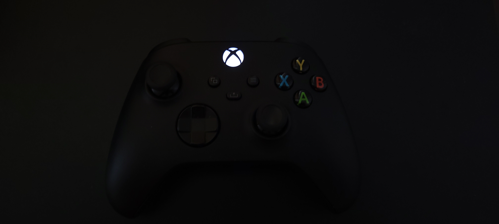
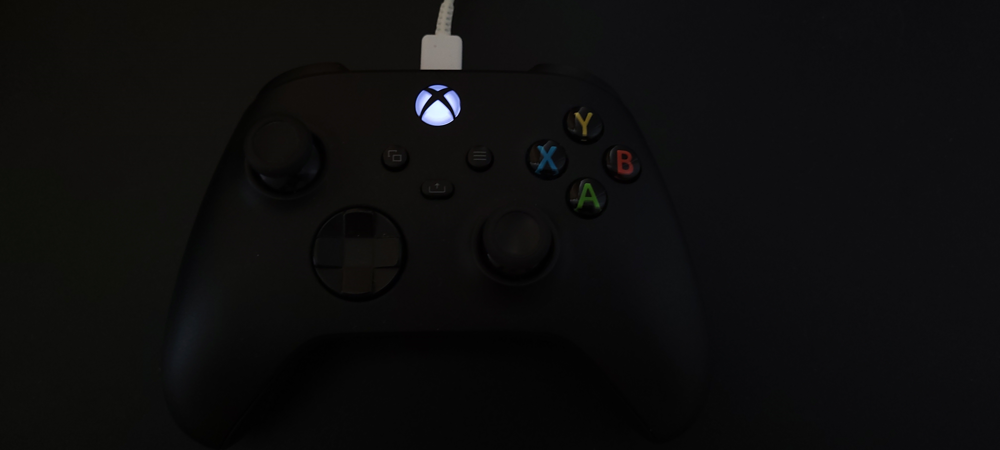

# change-xbox-controller-light

Simple Python script to change the light brightness on an Xbox One/Series controller

Only tested with an Xbox Series controller. Should work with Xbox One controllers as well.

# How to use (windows)?
First of all and unfortunately, it only works wired. If you intend to try using bluetooth connection, it won't works.
Controller tested: ```Model 1914```

- First, you need to install [Python 3](https://www.python.org/downloads/).
- While installing, enable "Add Python to environment variables" option.
- After installing, open a prompt (cmd, bash, etc...) as administrator and navigate to the repository folder. If you don't open as administrator, a window open asking for permission to run as administrator.
- Type ```pip install -r requirements.txt```.
- Wait the install finish.
- Type ```python app.py [0-1]```, while ```0``` being off and ```1``` being full bright. For example, you want it really bright but not completely, type ```python app.py 0.8```.
- Restart your controller. It should be done.

</br>
In this exemple, the first image is the controller with full bright as value 1.
</br>

</br>
</br>


This second image is the bright set as value 0.1.
